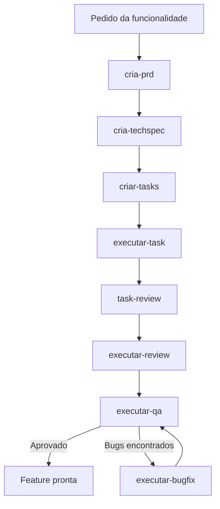

# Workflow de Uso das Skills

Este repositorio organiza um fluxo de trabalho orientado por skills para sair de uma ideia de funcionalidade e chegar ate implementacao, review, QA e correcao de bugs.

O fluxo operacional recomendado e:

1. `cria-prd`
2. `cria-techspec`
3. `criar-tasks`
4. `executar-task`
5. `task-review`
6. `executar-review`
7. `executar-qa`
8. `executar-bugfix` se o QA encontrar bugs
9. `executar-qa` novamente ate aprovar

[Excalidraw](https://excalidraw.com/#json=pMxpFeaHZAEk9XsEFA4F_,CNkvj08fnEks9JeqheoKnA)

## Copiar skills

```bash
npx skills add https://github.com/dealmeidafernando/skills
```

## Visao Geral do Fluxo



## Estrutura Gerada por Feature

Cada feature deve convergir para uma pasta no formato `tasks/prd-[feature-slug]/`.

Arquivos esperados ao longo do processo:

- `tasks/prd-[feature-slug]/prd.md`
- `tasks/prd-[feature-slug]/techspec.md`
- `tasks/prd-[feature-slug]/tasks.md`
- `tasks/prd-[feature-slug]/[num]_task.md`
- `tasks/prd-[feature-slug]/[num]_task_review.md`
- `tasks/prd-[feature-slug]/bugs.md`

## Ordem dos Agentes

### 1. `cria-prd`

Objetivo:
Definir o problema, os usuarios, os objetivos, o escopo e os requisitos funcionais.

Entradas:

- Nome ou descricao da funcionalidade
- Respostas de clarificacao do usuario

Saida principal:

- `tasks/prd-[feature-slug]/prd.md`

Regras da etapa:

- Sempre faz clarificacao antes de escrever.
- Sempre apresenta um plano antes de gerar o documento.
- Foca em `o que` e `por que`, nunca em implementacao.

Quando usar:

- Quando a feature ainda nao tem requisito formalizado.

Prompt sugerido:

```text
Use a skill cria-prd para criar o PRD da funcionalidade [nome-da-feature].
```

### 2. `cria-techspec`

Objetivo:
Transformar o PRD em especificacao tecnica com arquitetura, interfaces, dados, testes e impacto tecnico.

Pre-requisito:

- O arquivo `prd.md` precisa existir.

Entradas:

- Feature slug
- `tasks/prd-[feature-slug]/prd.md`

Saida principal:

- `tasks/prd-[feature-slug]/techspec.md`

Regras da etapa:

- Le o PRD inteiro.
- Faz analise profunda do projeto antes de perguntar.
- Pesquisa documentacao tecnica antes das clarificacoes finais.
- Foca em `como` implementar.

Quando usar:

- Depois que o PRD estiver aprovado e antes de quebrar em tasks.

Prompt sugerido:

```text
Use a skill cria-techspec para gerar a especificacao tecnica da feature [feature-slug].
```

### 3. `criar-tasks`

Objetivo:
Quebrar PRD e Tech Spec em entregas incrementais, sequenciadas e testaveis.

Pre-requisitos:

- `prd.md` existente
- `techspec.md` existente

Entradas:

- `tasks/prd-[feature-slug]/prd.md`
- `tasks/prd-[feature-slug]/techspec.md`

Saidas principais:

- `tasks/prd-[feature-slug]/tasks.md`
- `tasks/prd-[feature-slug]/[num]_task.md`

Regras da etapa:

- Primeiro apresenta a lista de alto nivel para aprovacao.
- So depois gera arquivos.
- Cada task deve ser uma entrega funcional.
- Cada task deve incluir testes de unidade e integracao.

Quando usar:

- Depois da Tech Spec aprovada.

Prompt sugerido:

```text
Use a skill criar-tasks para quebrar a feature [feature-slug] em tasks executaveis.
```

### 4. `executar-task`

Objetivo:
Implementar uma task especifica lendo task, PRD e Tech Spec antes de codar.

Pre-requisitos:

- A task precisa existir.
- Dependencias de tasks anteriores devem estar concluidas ou explicitamente aceitas.

Entradas:

- `tasks/prd-[feature-slug]/[num]_task.md`
- `tasks/prd-[feature-slug]/prd.md`
- `tasks/prd-[feature-slug]/techspec.md`

Saidas esperadas:

- Codigo implementado
- Testes criados e executados
- Task marcada como concluida em `tasks.md`

Regras da etapa:

- Sempre le os tres documentos de contexto.
- Carrega skills complementares de tecnologia quando necessario.
- Planeja e implementa em seguida, sem parar no plano.
- So conclui depois de testar.

Quando usar:

- Para executar uma task individual.

Prompt sugerido:

```text
Use a skill executar-task para implementar a task [num] da feature [feature-slug].
```

### 5. `task-review`

Objetivo:
Validar a qualidade da entrega de uma task especifica e gerar um artefato de review no mesmo diretorio da task.

Entradas:

- Arquivo da task
- Diff e arquivos alterados

Saida principal:

- `tasks/prd-[feature-slug]/[num]_task_review.md`

Regras da etapa:

- Foco em uma task concluida.
- Classifica achados em critical, major, minor e positive.
- Verifica padroes de codigo, tipagem e testes.

Quando usar:

- Logo apos concluir uma task.
- Especialmente util quando o time trabalha task por task.

Prompt sugerido:

```text
Use a skill task-review para revisar a task [num] da feature [feature-slug].
```

### 6. `executar-review`

Objetivo:
Fazer um code review mais amplo da implementacao, olhando diffs, aderencia a Tech Spec, tasks e regras do projeto.

Entradas:

- `techspec.md`
- `tasks.md`
- Diff Git e contexto dos arquivos alterados

Saida principal:

- Relatorio estruturado de review

Regras da etapa:

- Nao e o mesmo review da task.
- Tem escopo mais amplo e mais proximo de pre-merge.
- Roda testes e typecheck como parte do gate.

Quando usar:

- Apos uma task relevante.
- Ou ao final de um conjunto de tasks antes do QA.

Prompt sugerido:

```text
Use a skill executar-review para revisar a implementacao da feature [feature-slug].
```

### 7. `executar-qa`

Objetivo:
Validar a feature implementada contra o PRD, a Tech Spec e as tasks por meio de testes E2E, verificacao visual e acessibilidade.

Pre-requisitos:

- Aplicacao precisa estar rodando em localhost.
- Implementacao e review tecnico devem estar em estado estavel.

Entradas:

- `prd.md`
- `techspec.md`
- `tasks.md`
- Aplicacao em execucao

Saidas principais:

- `tasks/prd-[feature-slug]/bugs.md` se houver bugs
- Relatorio de QA

Regras da etapa:

- Verifica todos os requisitos funcionais do PRD.
- Usa Playwright MCP para evidencias.
- Faz checks de acessibilidade e verificacao visual.

Quando usar:

- Depois do review tecnico.

Prompt sugerido:

```text
Use a skill executar-qa para validar a feature [feature-slug].
```

### 8. `executar-bugfix`

Objetivo:
Corrigir bugs documentados em `bugs.md`, atacar causa raiz, adicionar testes de regressao e revalidar.

Pre-requisito:

- `tasks/prd-[feature-slug]/bugs.md` existente

Entradas:

- `bugs.md`
- `prd.md`
- `techspec.md`

Saidas principais:

- Bugs corrigidos
- `bugs.md` atualizado
- Relatorio de bugfix

Regras da etapa:

- Corrige por severidade: alta, media, baixa.
- Sempre cria testes de regressao.
- Para bugs de frontend, faz validacao visual.

Quando usar:

- Sempre que o QA documentar bugs.

Prompt sugerido:

```text
Use a skill executar-bugfix para corrigir os bugs da feature [feature-slug].
```

## Gates do Processo

Cada etapa tem um gate claro antes da seguinte:

1. `cria-prd` so termina quando o PRD estiver salvo.
2. `cria-techspec` so comeca se o PRD existir.
3. `criar-tasks` so comeca se PRD e Tech Spec existirem.
4. `criar-tasks` so gera arquivos depois da aprovacao da lista de alto nivel.
5. `executar-task` so conclui depois de implementar, testar e marcar a task.
6. `task-review` valida a task individual.
7. `executar-review` valida a aderencia global da implementacao.
8. `executar-qa` aprova ou gera `bugs.md`.
9. `executar-bugfix` devolve o fluxo para `executar-qa`.

## Fluxo Minimo Recomendado

Para uma feature nova, a sequencia minima recomendada e:

1. Criar PRD.
2. Criar Tech Spec.
3. Criar Tasks.
4. Executar task por task.
5. Revisar cada task.
6. Rodar review consolidado.
7. Rodar QA.
8. Corrigir bugs se existirem.
9. Rodar QA novamente.

## Fluxo por Task

Quando a feature ja esta planejada e o foco e entrega incremental:

1. Selecionar a task no arquivo `tasks.md`.
2. Rodar `executar-task` para a task.
3. Rodar `task-review` para gerar o artefato de revisao da task.
4. Ajustar eventuais problemas encontrados.
5. Seguir para a proxima task.
6. Ao fechar um bloco funcional, rodar `executar-review`.

## Automacao com `runtasks.sh`

O script [runtasks.sh](/Users/fernandosilva/workspace/dealmeidafernando/skills/runtasks.sh) executa tasks de uma pasta PRD de forma sequencial via Cursor CLI.

Comportamento do script:

- Verifica se existem `tasks.md`, `prd.md` e `techspec.md`.
- Descobre arquivos `*_task.md`.
- Pula tasks marcadas como concluidas por padrao.
- Dispara o agent com a instrucao de usar `executar-task`.
- Instrui que um review final da task seja executado ao final.

Exemplos:

```bash
./runtasks.sh tasks/prd-painel-clima
./runtasks.sh tasks/prd-painel-clima --no-skip-completed
./runtasks.sh tasks/prd-painel-clima --force --approve-mcps --trust
```

## Decisao Rapida: Qual Skill Usar?

Use esta regra simples:

- Ainda nao existe requisito formal: `cria-prd`
- Ja existe PRD e falta desenho tecnico: `cria-techspec`
- Ja existe PRD e Tech Spec e falta planejamento de execucao: `criar-tasks`
- Existe task e precisa implementar: `executar-task`
- Existe task implementada e voce quer revisar a entrega da task: `task-review`
- Existe um conjunto de mudancas e voce quer um review tecnico mais completo: `executar-review`
- A feature precisa ser validada funcionalmente: `executar-qa`
- O QA encontrou bugs: `executar-bugfix`

## Resumo Executivo do Processo

O processo tem duas camadas de controle:

- Camada de planejamento: `cria-prd` -> `cria-techspec` -> `criar-tasks`
- Camada de execucao e qualidade: `executar-task` -> `task-review` -> `executar-review` -> `executar-qa` -> `executar-bugfix` quando necessario

Se quiser manter o fluxo disciplinado, trate `executar-qa` como gate final de aceite e `executar-bugfix` como loop de retorno obrigatorio sempre que houver defeitos documentados.
